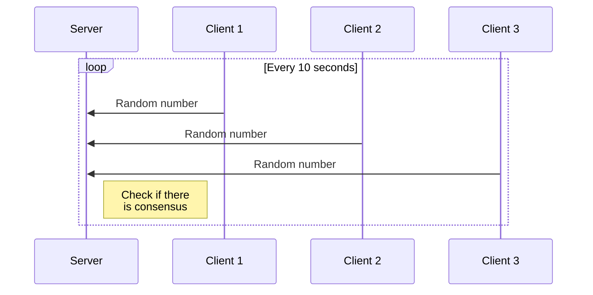

# Practica2-REST

## Introducción
Programa muy simple en el cual mediante un script en bash simulamos 3 clientes que envían 3 números aleatorios a un servidor. Una vez éste los recibe decide si hay consenso o no. Para que haya consenso almenos dos de ellos tienen que ser iguales


  

## Instrucciones

### Ejectuar el servidor 
```console
export FLASK_APP=app.py  
python3 -m flask run
```

### Dar permisos al script del cliente
```console
chdmod +x script.sh
```
### Ejecturar el script del cliente
```console
./script.sh
```